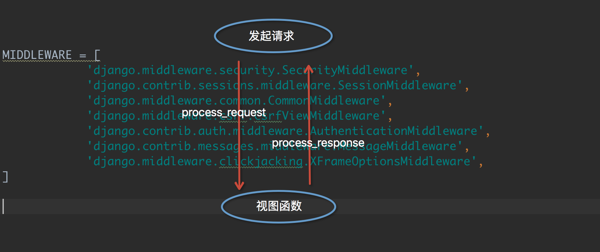
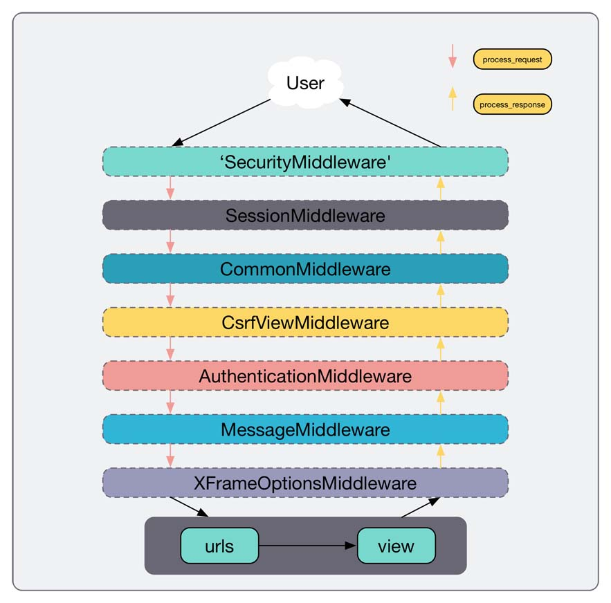

https://www.cnblogs.com/sui776265233/p/9664642.html
# django中间件？

## 1. 什么是中间件？

中间件，顾名思义，是一种介于request和reponse处理之间的一道处理过程。
相对比较轻量级，冰并且在全局改变django的输入和输出。
因为是改变全局，所以需要谨慎使用，用不好会影响性能。

中间件位于web服务端和url路由层之间。

## 2. 中间件有什么用？

如果你想要修改请求，比如被传送到view中的HttpRequest对象，或者你想要修改view返回的HttpResponse对象，这些都可以通过中间件来实现。

django自带的中间件？
```text
MIDDLEWARE = [
    'django.middleware.security.SecurityMiddleware',
    'django.contrib.sessions.middleware.SessionMiddleware',
    'django.middleware.common.CommonMiddleware',
    'django.middleware.csrf.CsrfViewMiddleware',
    'django.contrib.auth.middleware.AuthenticationMiddleware',
    'django.contrib.messages.middleware.MessageMiddleware',
    'django.middleware.clickjacking.XFrameOptionsMiddleware',
]
```

## 3. 自定义中间件？

中间件可以定义5个方法，分别是：(主要的是process_request和process_response)

1. process_request(self,request)
2. process_view(self, request, callback, callback_args, callback_kwargs)
3. process_template_response(self,request,response)
4. process_exception(self, request, exception)
5. process_response(self, request, response)

以上方法的返回值可以是None或一个HttpResponse对象，
如果是None，则继续按照django定义的规则向后继续执行，如果是HttpResponse对象，则直接将该对象返回给用户。
    
```python
from django.middleware.security import SecurityMiddleware
from django.contrib.sessions.middleware import SessionMiddleware
from django.middleware.common import CommonMiddleware
from django.middleware.csrf import CsrfViewMiddleware
from django.contrib.auth.middleware import AuthenticationMiddleware
from django.contrib.messages.middleware import MessageMiddleware
from django.middleware.clickjacking import XFrameOptionsMiddleware
```

以下为主要用法：

(1) process_request和process_response

当用户发起请求的时候会依次经过所有的中间件，这个时候请求的是process_request，最后到达view的函数里，
view函数处理后，会再次穿过中间件，这个时候是process_response，最后返回给请求者。





自定义中间件必须继承MiddlewareMixin


(2) process_view


(3) process_exception


(4) process_template_response(self,request,response)


## 4. 中间件应用场景？


## 5. csrf_token跨站点请求伪造？


